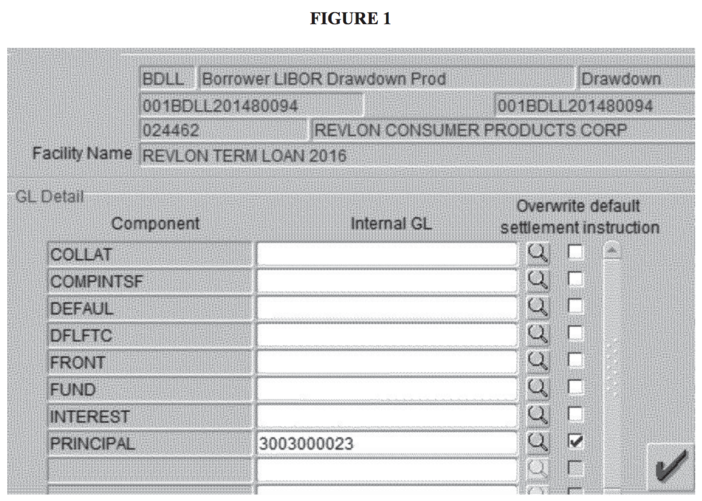
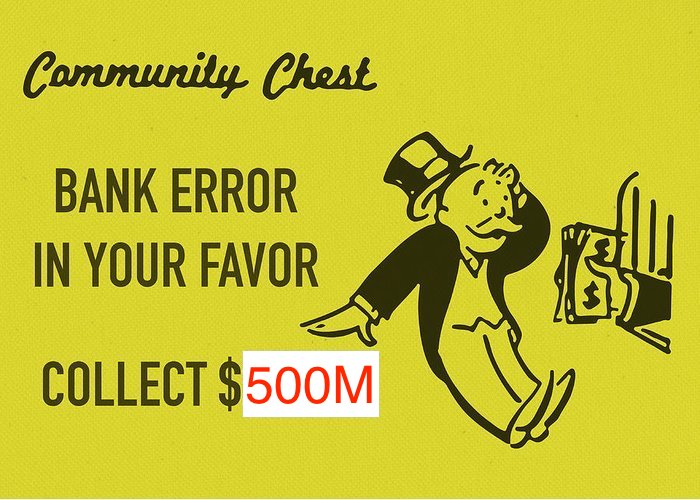

*Disclaimer: I am not a lawyer. I am not providing financial advice of any kind. This post only shares **my** opinions on the costs of poorly written software.*

---

Citibank basically just spent about $500 million on a poorly-designed confirmation dialog in their internal banking software. A New York federal judge [ruled][court-opinion] today that they're not getting this money back, at least from who they sent it to.

Wait, *what*?

# The Background: Rice, Beans, and COVID-19

On 2020-08-11, Citibank, acting on behalf of its client Revlon (yes, [*that* Revlon](https://en.wikipedia.org/wiki/Revlon)), transferred $894 million to Revlon's creditors. What's unusual about this transaction? Coincidentally, $894 million also happens to be the "amount equal to the outstanding principal of the 2016 Term Loan"[[1][court-opinion]], provided by said creditors to Revlon.

Why would Revlon pay off the entire principal amount of a 4-year-old loan in one fell swoop? Were interest rates unfavourable? No, [LIBOR](https://en.wikipedia.org/wiki/Libor) is at the lowest it's ever been. Had they fallen upon some good times? Quite the opposite - their "liquidity position" (i.e. cash pile) was considered "extremely tight" (i.e. on a diet of rice and beans) in the spring of 2020, which is understandable considering the COVID-19 pandemic. Revlon, a cosmetics, skincare, and fragrance company, would presumably have less business with everyone forgoing makeup and perfume while staying home. In this pinched situation, Revlon decided the time was right to raise some more money through some new loans.

This injection of cash would end up requiring them to pay interim interest accrued on all existing loans, due to a "technical limitation"[[1][court-opinion]] of Citibank's software. This came out to a sum of around $7.8 million[[1][court-opinion]]. Revlon's bank, Citibank, would mediate the transfer of money, much like how I pay my credit card bills using my bank account. On 2020-08-11, Revlon instructed Citibank to pay this interest to its lenders. Critically, *Citibank did not notify Revlon's lenders of this impending interest payment*.

# The Transaction: 3 Blind Mice with 6 Eyes

So if you're Citibank, and your client asks you to wire accrued interest to all of its lenders for a particular tranche of its debt, how do you do it?

1. Tell your Asset-Based Transitional Finance Team (ABTF) to execute the transaction.
2. Your ABTF fires up [FLEXCUBE][flexcube] to begin the "6-eyes" review process:
    1. Eyes 1 & 2 - the maker: An ABTFer creates the transaction in FLEXCUBE.
    2. Eyes 3 & 4 - the checker: The transaction is shown to the ABTFer's supervisor.
    3. Eyes 5 & 6 - the approver: The supervisor shows the transaction to a Citibank senior manager.
3. The checker hits the "confirm" button and the money is sent to the recipient(s).

## Step 1: ABTF'd Up

So which Citibank employees are on the ABTF? Not that many - it turns out that Citibank outsources most of this work to Wipro Limited, an Indian multinational IT and business consulting corporation.

## Step 2: Enter Oracle

What's FLEXCUBE? It's an Oracle product that's ostensibly "designed to modernize a bank’s core systems efficiently and transform the bank to a digital, agile, connected and efficient bank of tomorrow."[[2][flexcube]] And "6 eyes"? That's Citibank's internal-speak for the 3-person review process for any large transaction before it's executed. "6 eyes" definitely sounds cooler than "3-person" - it's one more than [5 eyes](https://en.wikipedia.org/wiki/Five_Eyes)!

In FLEXCUBE, according to the judge's opinion, "the easiest (or perhaps only) way to execute the [interest payment] transaction" is to basically set up a transaction *pretending* to send the full loan amount to an account, and instruct the software to calculate the interest and send it elsewhere. The standard operating procedure (i.e. horrible workaround) at Citibank is to send the full loan amount to an internal-use-only "wash account", and instruct FLEXCUBE to send the interest amount to the creditors. At this point, I'm sure you can see where this is going. **Mistake 1: using software that you have to work around, not with**.

## Step 3.1: The Maker

Santhosh Kuppusamy Ravi, a Wipro employee, is instructed by his manager Arokia Raj (another Wipro employee) to process the transaction in FLEXCUBE. What does this look like?

Yeah, pretty horrendous design. Matt Levine of Bloomberg Opinion describes it pretty well[[3][levine]]:

> See, the "don’t actually send the money" box next to "PRINCIPAL" is checked, but that doesn’t do anything, you have to check two other boxes to make it not actually send the money.

## Step 3.2: The Checker

Raj, Ravi's manager, checks the transaction. It seems ok to him, so he finally sends it to a Citibank employee stateside. Clearly, Raj and Ravi didn't notice anything amiss about the erroneous transaction. Would they have taken more care if they were Citibank employees? Perhaps - there's something to be said about organization large transactions carefully when it's your own bottom line instead of someone else's.

At this point, it's worth noting that Citibank's Institutional Clients Group spends about $5.7B each quarter in operating expenses[[4, page 26][sec]]. Some chunk of this is being spent on a Wipro contract, ostensibly to save having to hire more Citibank employees. **Mistake 2: outsourcing the first 4 eyes in a "6 eyes" procedure**.

Another chunk of this $5.7B was spent on Oracle's Flexcube software. When an organization reaches for an off-the-shelf product, it's usually with the goal of cutting in-house costs. For software, this decision might be cost-driven: you can save time and money by not having to stand up a team of developers to build and maintain an in-house tool. This might make sense if you're running a company that doesn't have a software culture, like a bank. The main downside of this decision is pretty simple: software sold by a vendor might not match your use-case exactly, so instead of making your tool work for you, you have to adapt your process to the tool (see Mistake 1). For something as bespoke as multimillion dollar transactions, maybe it would be better to develop something in-house - the design process will be closer to the users, so ideally the end result would fit the business need perfectly. Or, at the very least, paying for some consultants to custom-build a tool. So, this leads us to **Mistake 3: buying an off-the-shelf product for a bespoke business need**.

I really wonder if these decisions turned out to be cheaper after Revlon's creditors got a windfall.

## Step 3.3: The Approver

When Vincent Fratta, "a Citibank senior manager based in Delaware", saw the transaction, he thought it seemed fine and *assumed* that the full loan amount was going to the wash account so the interest could be calculated, *not* to Revlon's lenders. I can only guess at the multiple factors that led to Fratta's mistake: the janky interface, not being colocated with the contractors, or even [checklist fatigue](https://pubmed.ncbi.nlm.nih.gov/26197378/). It's easy to sympathize with Fratta -- we all want to believe the best of people to some extent, and no one wants to be a micromanager. When dealing with safety critical processes, like flying a passenger airliner, a culture of professional skepticism is key. Copilots are specifically trained to question their captain if they believe the captain's judgement to be incorrect -- if this isn't done, [disaster](https://en.wikipedia.org/wiki/Korean_Air_Flight_801) will follow. The same discipline should apply when handling transactions for large sums of money. **Mistake 4: Not practicing a culture of professional skepticism**.

# The Result

This horrific series of mistakes led to Citibank transferring $894 million *of its own money* to Revlon's incredulous creditors. Some of them returned the money immediately - this amounted to about $400 million. The rest kept the remaining $500 million and Citibank sued to try and get it back. The court case continued until today.

# The Decision

On 2021-02-17, the Southern District of New York ruled that Citibank, could not get that $500 million back from Revlon's creditors. So, this was a $500 million outsourcing bill. Or a $500 million user interface. Or a $500 million study in why heavyhanded processes lead to blindly checking boxes. Or, finally, a $500 million windfall for Revlon's creditors.

Yep, that's right:

# Sources

1. [UNITED STATES DISTRICT COURT SOUTHERN DISTRICT OF NEW YORK IN RE CITIBANK AUGUST 11, 2020 WIRE TRANSFERS][court-opinion]
2. [Oracle FLEXCUBE Universal Banking][flexcube]
3. [Citi Can’t Have Its $900 Million Back - Bloomberg][levine]
4. [Citigroup Inc 10-Q for the quarterly period ended September 30, 2020 - SEC][sec]
[flexcube]: https://www.oracle.com/industries/financial-services/banking/flexcube-universal-banking/

[court-opinion]: https://www.courtlistener.com/recap/gov.uscourts.nysd.542310/gov.uscourts.nysd.542310.243.0_2.pdf
[levine]: https://www.bloomberg.com/opinion/articles/2021-02-17/citi-can-t-have-its-900-million-back
[sec]: https://www.sec.gov/ix?doc=/Archives/edgar/data/831001/000083100120000110/c-20200930.htm
