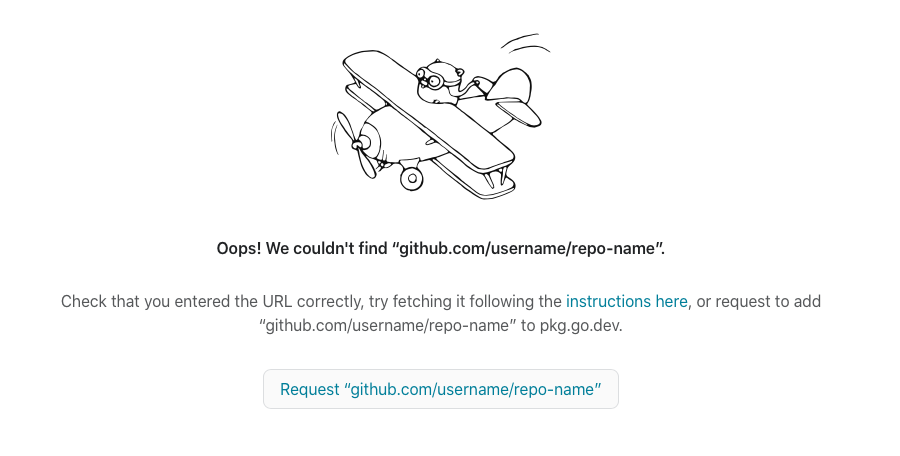

As I mentioned in a [previous post](/how-the-dnd-digital-hr-app-dev-team-does-agile-rituals), I'm currently the Scrum Master of the DND Digital HR AppDev team. One of my duties is running the daily standup meetings, where each team member gives their update on what they're up to and if they have any impediments. Since we're a distributed team, we have our standups via an audio call. When I first started running standups, I found that when we did popcorn updates, there was always an awkward pause between updates because no one wanted to go next. I quickly decided to have a defined order in standups, but to also randomize the order to keep things varied. This was pretty simple to implement in a hardcoded Python script that uses `random.shuffle()`:

```python
import random
from datetime import datetime

members = ["Alice", "Bob", "Carol", "David"]
random.shuffle(members)
print(f"# {datetime.now()}:\n")
[print(name) for name in members]
```

In the terminal, its invocation looked like:

```
$ python standup-script-py
# 2021-04-27 09:33:36.262600

David
Bob
Alice
Carol
```

and I could easily copy and paste this output into our meeting chat a few minutes before we started so everyone would know the order ahead of time. Not a well-engineered script by any means, but it did the job.

# The Rewrite

A few weeks ago, I began learning Go. I like it, *a lot*. Go seems very C-like, without the manual memory management footguns and a small syntax simpler than even C's already-sparse lexicon. As part of my journey, I thought it would be an interesting exercise to rewrite my little standup randomizer program in Go, with the following additional requirements:

* generalized: no hardcoding of team members, preferably reading in a TOML file defining the team roster
* covered by tests
* publishable to pkg.go.dev
* installable to PATH with `go get` (I discovered `go install` later)
* pure CI/CD PR checks and autoreleases

This was the final result: https://github.com/jidicula/random-standup

It uses a team roster TOML that looks like this:

```toml
[Subteam-1]
members = [
        "Alice",                # TOML spec allows whitespace to break arrays
        "Bob",
        "Carol",
        "David"
        ]

["Subteam 2"]                   # Keys can have whitespace in quoted strings
members = ["Erin", "Frank", "Grace", "Heidi"]

["Empty Subteam"]               # Subteam with 0 members won't be printed

["Subteam 3"]
members = [
        "Ivan",
        "Judy",
        "Mallory",
        "Niaj"
]
```

When invoked, the program outputs:

```
$ random-standup example-roster.toml
# 2021-03-27
## Subteam-1
Alice
David
Bob
Carol

## Subteam 2
Grace
Heidi
Frank
Erin

## Subteam 3
Judy
Niaj
Ivan
Mallory
```

# The Re-rewrite: Python Edition

I thought it would be an even more interesting exercise to try writing the same tool in Python too, just to compare the process of writing a CLI tool (and so I'd have a reason to write a blogpost). The Python implementation of this tool can be seen [here](https://github.com/jidicula/random-standup-py). It accepts the same TOML file that the Go implementation accepts, and is invoked in the same way.

# Interlude: Why TOML?

Config files should be readable and editable by both humans and machines. What defines this? A format with a clear specification (for the machines to parse) and easy on the eyes/fingers (for humans to read and modify). There are a few popular options:
* XML: Basically HTML - tricky to read and tricky to edit by hand. Diffs will be messy.
* .INI: Several competing specifications, so really not even worth considering.
* YAML: An improvement over XML in readability, but the whitespace-as-syntax might trip you up. [GitHub Actions](https://docs.github.com/en/actions) uses this for defining workflows, and tools like [Dependabot](https://docs.github.com/en/code-security/supply-chain-security/keeping-your-dependencies-updated-automatically) and [pre-commit](https://pre-commit.com) read configurations from YAML files.
* JSON: The de facto format for passing around data in webdev, with a dictionary-like syntax. Hope you like commas and braces.
* TOML: A happy medium between human and machine readability. Used for specifying Rust project dependencies in `Cargo.toml`, and for [Python project configs in `pyproject.toml`][pep-631].

# The Differences

## Project Structure

The Go implementation is very simple in this regard. Indeed, Go notably doesn't have any requirements about where files and folders should be located, despite some groups that [claim otherwise](https://github.com/golang-standards/project-layout/issues/117#issuecomment-828503689). The only real Go code in my repo are 2 `.go` files (1 for the program and 1 for its tests) and the `go.mod` and `go.sum` manifest files. There was only one sticky point I ran into, where I initially incorrectly defined the module name in `go.mod` - this has to match the repository name (`github.com/jidicula/random-standup`).

For me, figuring this out with Python wasn't easy, especially when using [`pyproject.toml` for dependency specification][pep-631]. I opted to use Poetry to organize my dependencies and project settings (more on this later), and Poetry has a builtin command (`poetry new <packagename>`) for creating a "recommended" project structure that looks somewhat like this:

```
foo-bar
├── README.rst
├── foo_bar
│   └── __init__.py
├── pyproject.toml
└── tests
    ├── __init__.py
    └── test_foo_bar.py
```
(This pretty filetree output is courtesy of the [`tree` tool](http://mama.indstate.edu/users/ice/tree/), which is also available via Homebrew.)

This seemed to be a format more geared towards a Python package intended to be a library imported by other projects - probably overkill for a CLI tool. After some digging, I instead followed the [structure recommended by the Python Packaging Authority](https://packaging.python.org/tutorials/packaging-projects/#creating-the-package-files):

```
packaging_tutorial/
├── LICENSE
├── pyproject.toml
├── README.md
├── setup.cfg
├── setup.py  # optional, needed to make editable pip installs work
├── src/
│   └── example_pkg/
│       └── __init__.py
└── tests/
```

The key here is that the package's source code is in `project_name/src/package_name/some_name.py` and its tests are in `project_name/tests/test_some_name.py`, with the cursory `__init__.py` in directories containing `.py` files. While retracing my steps for this blogpost, I also came across [this recommended structure](https://docs.python-guide.org/writing/structure/) from The Hitchhiker's Guide to Python:

```
foo
├── LICENSE
├── README.rst
├── docs
│   ├── conf.py
│   └── index.rst
├── requirements.txt
├── sample
│   ├── __init__.py
│   ├── core.py
│   └── helpers.py
├── setup.py
└── tests
    ├── test_advanced.py
    └── test_basic.py
```
Overall, quite similar to what I went with, minus the `src/` directory that doesn't seem to do much, and replacing `pyproject.toml` and `poetry.lock` with `setup.py` and `requirements.txt`. I didn't really try exploring different options at the time, as I wasn't sure if Poetry would be able to build the wheels with different project structures.

All of this to say, packaging and file structure wasn't as immediately obvious with Python as it was with Go.

## Packaging and Publishing

Go was ridiculously simple in this area too. All that's needed for listing on [pkg.go.dev][random-standup-pkg] is a valid `go.mod` file. The site also has some other [recommendations](https://go.dev/about#best-practices), like a stable tagged version and a LICENSE file. Go's package registry requires no additional authentication - when you navigate to `pkg.go.dev/github.com/username/repo-name`, it prompts you to trigger autopopulation of the package entry:


(You can add a version tag to the end of the URL, like `@v1.0.0`, to autopopulate a newly released version of your package.)

There are also some other programmatic ways to trigger addition of a package to the registry, listed [here](https://go.dev/about#adding-a-package).

Once again, Python was not as simple as Go.

[pep-631]: https://www.python.org/dev/peps/pep-0631/
[random-standup-pkg]: https://pkg.go.dev/github.com/jidicula/random-standup
