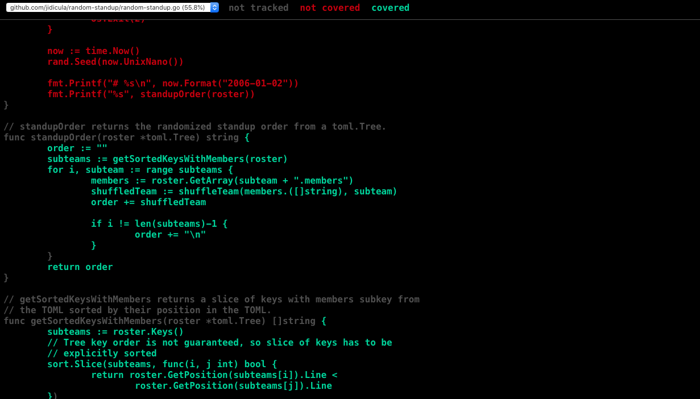
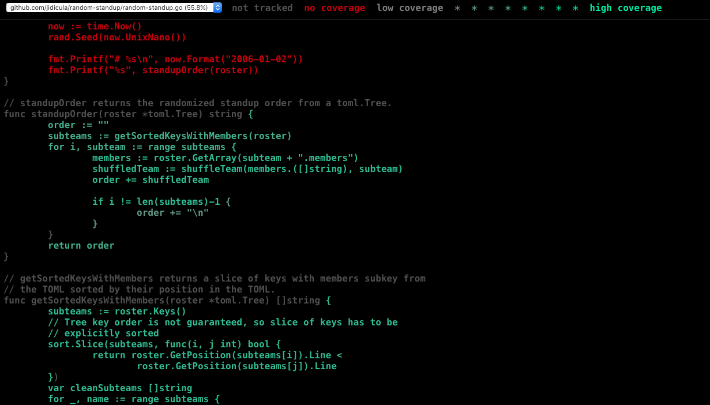

As I mentioned in a [previous post](/how-the-dnd-digital-hr-app-dev-team-does-agile-rituals), I'm currently the Scrum Master of the DND Digital HR AppDev team. One of my duties is running the daily standup meetings, where each team member gives their update on what they're up to and if they have any impediments. Since we're a distributed team, we have our standups via an audio call. When I first started running standups, I found that when we did popcorn updates, there was always an awkward pause between updates because no one wanted to go next. I quickly decided on having a defined order in standups, but to also randomize the order to keep things varied. This was pretty simple to implement in a hardcoded Python script that uses `random.shuffle()`:

```python
import random
from datetime import date

members = ["Alice", "Bob", "Carol", "David"]
random.shuffle(members)
print(f"# {date.today()}:\n")
[print(name) for name in members]
```

In the terminal, its invocation looked like:

```
$ python standup-script-py
# 2021-04-27

David
Bob
Alice
Carol
```

and I could easily copy and paste this output into our meeting chat a few minutes before we started so everyone would know the order ahead of time. Not a well-engineered program by any means, but it did the job.

# The Rewrite

A few weeks ago, I began learning Go. I like it, *a lot*. Go seems very C-like, without the manual memory management footguns and a small syntax simpler than even C's already-sparse lexicon. As part of my journey, I thought it would be an interesting exercise to rewrite my little standup randomizer program in Go, with the following additional requirements:

* generalized: no hardcoding of team members, preferably reading in a [TOML](./2021-05-01-Why-TOML.md) file defining the team roster
* covered by tests
* publishable to pkg.go.dev
* installable to PATH with [`go get`](https://golang.org/ref/mod#go-get) (I discovered [`go install`](https://golang.org/ref/mod#go-install) later)
* pure CI/CD PR checks and autoreleases

This was the final result: https://github.com/jidicula/random-standup

It uses a team roster TOML that looks like this:

```toml
[Subteam-1]
members = [
        "Alice",                # TOML spec allows whitespace to break arrays
        "Bob",
        "Carol",
        "David"
        ]

["Subteam 2"]                   # Keys can have whitespace in quoted strings
members = ["Erin", "Frank", "Grace", "Heidi"]

["Empty Subteam"]               # Subteam with 0 members won't be printed

["Subteam 3"]
members = [
        "Ivan",
        "Judy",
        "Mallory",
        "Niaj"
]
```

When invoked, the program outputs:

```
$ random-standup example-roster.toml
# 2021-03-27
## Subteam-1
Alice
David
Bob
Carol

## Subteam 2
Grace
Heidi
Frank
Erin

## Subteam 3
Judy
Niaj
Ivan
Mallory
```

# The Re-rewrite: Python Edition

I thought it would be an even more interesting exercise to try writing the same tool in Python too, just to compare the process of writing a CLI tool (and so I'd have a reason to write a blogpost). The Python implementation of this tool can be seen [here](https://github.com/jidicula/random-standup-py). It accepts the same TOML file that the Go implementation accepts, and is invoked in the same way.

# The Differences

## Project Structure

The Go implementation is very simple in this regard. Indeed, Go notably doesn't have any requirements about where files and folders should be located, despite some groups that [claim otherwise](https://github.com/golang-standards/project-layout/issues/117#issuecomment-828503689). The only real Go code in my repo are 2 `.go` files (1 for the program and 1 for its tests) and the `go.mod` and `go.sum` manifest files. There was only one sticky point I ran into, where I initially incorrectly defined the module name in `go.mod` - this has to match the repository name (`github.com/jidicula/random-standup`).

For me, figuring this out with Python wasn't easy, especially when using [`pyproject.toml` for dependency specification][pep-631]. I opted to use [Poetry][poetry] to organize my dependencies and project settings (more on this later), and Poetry has a builtin command (`poetry new <packagename>`) for creating a "recommended" project structure that looks somewhat like this:

```
foo-bar
├── README.rst
├── foo_bar
│   └── __init__.py
├── pyproject.toml
└── tests
    ├── __init__.py
    └── test_foo_bar.py
```
(This pretty filetree output is courtesy of [`tree`](http://mama.indstate.edu/users/ice/tree/), which is also available via Homebrew.)

This seemed to be a format more geared towards a Python package intended to be a library imported by other projects - probably overkill for a CLI tool. After some digging, I instead followed the [structure recommended by the Python Packaging Authority](https://packaging.python.org/tutorials/packaging-projects/#creating-the-package-files):

```
packaging_tutorial/
├── LICENSE
├── pyproject.toml
├── README.md
├── setup.cfg
├── setup.py  # optional, needed to make editable pip installs work
├── src/
│   └── example_pkg/
│       └── __init__.py
└── tests/
```

The key here is that the package's source code is in `project_name/src/package_name/some_name.py` and its tests are in `project_name/tests/test_some_name.py`, with the cursory `__init__.py` in directories containing `.py` files. While retracing my steps for this blogpost, I also came across [this recommended structure](https://docs.python-guide.org/writing/structure/) from The Hitchhiker's Guide to Python:

```
foo
├── LICENSE
├── README.rst
├── docs
│   ├── conf.py
│   └── index.rst
├── requirements.txt
├── sample
│   ├── __init__.py
│   ├── core.py
│   └── helpers.py
├── setup.py
└── tests
    ├── test_advanced.py
    └── test_basic.py
```
Overall, quite similar to what I went with, minus the `src/` directory that doesn't seem to do much, and replacing `pyproject.toml` and `poetry.lock` with `setup.py` and `requirements.txt`. I didn't really try exploring different options at the time, as I wasn't sure if Poetry would be able to build the wheels with different project structures.

All of this to say, packaging and file structure wasn't as immediately obvious with Python as it was with Go.

## Packaging and Publishing

Go was ridiculously simple in this area too. All that's needed for listing on [pkg.go.dev][random-standup-pkg] is a valid `go.mod` file. The site also has some other [recommendations](https://go.dev/about#best-practices), like a stable tagged version and a LICENSE file. Go's package registry requires no additional authentication - when you navigate to `pkg.go.dev/github.com/username/repo-name`, it prompts you to trigger autopopulation of the package entry:


(You can add a version tag to the end of the URL, like `@v1.0.0`, to autopopulate a newly released version of your package.)

There are also some other programmatic ways to trigger addition of a package to the registry, listed [here](https://go.dev/about#adding-a-package).

Once again, Python was not as simple as Go. My choice to use [Poetry][poetry] certainly simplified the process - I just had to run `poetry publish --build` and follow the prompts for PyPI username and password authentication. It's even simpler in my CI configs, as Poetry and PyPI allow token-based authentication - my [GitHub Actions workflow publishing step](https://github.com/jidicula/random-standup-py/blob/545bf6a98e04450b256ab594514efadffe2755e1/.github/workflows/publish.yml#L47-L52) looks like this:

```yaml
      - name: Publish to PyPI
        env:
          PYPI_TOKEN: ${{ secrets.PYPI_TOKEN }}
        run: |
          poetry config pypi-token.pypi $PYPI_TOKEN
          poetry publish --build
```

If I was doing this in Python before I had learned about Go, this process would seem pretty straightforward. The main issue I have with even this simplified process is needing a PyPI account. This ostensibly helps prevent supply-chain attacks like [dependency confusion](https://arstechnica.com/information-technology/2021/02/supply-chain-attack-that-fooled-apple-and-microsoft-is-attracting-copycats/), where an account shadows the name of an internal package, or typo-squats a popular package in the hopes that a fat-fingered developer types a bit too hastily. However, I'm not sure if PyPI actually does any vetting for malicious packages - my package wasn't checked, to the best of my knowledge. On the other hand, Go took the rather sensible route of deferring any security concerns to the forge (i.e. GitHub, GitLab, Bitbucket, etc) hosting a module's source code and having no authentication step of its own. Since Go modules are named by their location (forge and username) as well as the package name itself, it's a bit trickier to shadow a company-internal package name with one published to `pkg.go.dev`. Additionally, typo-squatting is certainly still possible.

Poetry also handles the extremely messy Python landscape of handling dependencies and virtual environments. It has simple functionality for setting up a virtual environment and separating development from main dependencies by adhering to the [PEP 631][pep-631] specification for `pyproject.toml`. Before Poetry came along, most projects would opt for using `requirements.txt` and `pip`-installing from there, or using `setup.py`, or using other Python implementations like Anaconda. None of these can handle all 3 of: version-locking of dependencies, version resolution of multiple packages having the same dependent, and virtual environment setup. Setting up this project using Poetry just involves:

```
$ poetry shell      # creates virtual environment
$ poetry install    # installs main and dev dependencies
```

If I wasn't using Poetry, I'd likely have to use `setuptools` for package configuration - I don't really know much about this process, but it seems more complex just by virtue of having more steps (which usually means a wider surface for mistakes). Python's packaging tutorial first recommends using `pip` itself for [building the distribution archives](https://packaging.python.org/tutorials/packaging-projects/#generating-distribution-archives) from a project based on `setup.cfg` (preferred) or `setup.py` (recommended against), then using Twine for [uploading the build artifacts](https://packaging.python.org/tutorials/packaging-projects/#uploading-the-distribution-archives). I'm not familiar with this tooling, but the fact that there's no single PyPI-blessed approach is a cause for confusion in itself.

## Distribution

Go compiles to a single native binary - it includes everything it needs for its runtime without needing to link to any system libraries (unless you take the longer route and explicitly link to them). The clearest strength of this batteries-included approach is that the Go compiler allows you to cross-compile to 44 OS/architecture pairs using the `GOOS` and `GOARCH` environment variables! This means that you can just run the native binary on any of these 44 OS and architecture combinations without any additional dependencies. You can see all the OS/arch pairs by running `go tool dist list`. This batteries-included approach has a clear downside, though. A simple Hello, World program would contain:

```go
package main

import "fmt"

func main() {
	fmt.Println("Hello, World!")
}
```

When it's compiled with Go 1.16.3 on macOS 10.15.7 on an Intel processor, the Hello, World binary famously weighs in at a whopping 1.9 MB. The first release of the Go implementation of `random-standup` [is around 3 MB](https://github.com/jidicula/random-standup/releases/tag/v1.0.0).

The Python implementation isn't as simple to distribute across such a wide variety of hardware. Because Python is an interpreted language, executing Python source code requires a Python runtime (with the correct version!) to be already installed on the host machine. Installing and configuring that can be tedious or sometimes impossible for embedded systems - even on personal computers, managing multiple Python versions is a [headache](https://xkcd.com/1987/). On the size front, a Stack Overflow question suggests that the Python interpreter is [roughly 1 MB in size](https://stackoverflow.com/q/12631577/6310633). Coupled with the [4 KB wheel size](https://github.com/jidicula/random-standup-py/releases/tag/v1.0.0) of `random-standup-py` v1.0.0, we're taking up less than half the space of the Go implementation's binary, with 99.6% of that space going towards a runtime that can be reused for other programs.

## Testing

Go has fantastic testing support built in. A common Go pattern is to use table-driven tests, where you create a map or list of structs containing the inputs for the function you're testing, and the desired output. In this table, I'm creating a table for testing a function I wrote to accept a slice of a subteam's members' names and the subteam's name and return a stringified shuffled list of the members. The test cases are stored in a map, with the test name as the key, and the struct representing the test table as the value.

```go
tests := map[string]struct {
	teamMembers []string
	teamName    string
	want        string
}{
	"four names": {
        []string{"Alice", "Bob", "Carol", "David"},
        "Subteam 1",
        "## Subteam 1\nCarol\nBob\nAlice\nDavid\n"},
}
```

I would then iterate through the map, setting up a testing harness upon each iteration. Inside the testing harness, I call the function being tested, and check if the return result of `shuffleTeam(tests["four names"].teamMembers, tests["four names"].teamName)` matches `tests["four names"].want`:

```go
for name, tt := range tests {
	t.Run(name, func(t *testing.T) {
		rand.Seed(0)
		got := shuffleTeam(tt.teamMembers, tt.teamName)
		if got != tt.want {
			t.Errorf("%s: got %s, want %s", name, got, tt.want)
		}
	})
}
```

Dave Cheney wrote an [excellent blogpost about table-driven testing](https://dave.cheney.net/2019/05/07/prefer-table-driven-tests) where he recommends using a map for storing the test cases for 2 reasons:

1. The map keys indicate the name of a test case, so you can easily find which case failed.
2. [Map iteration order is undefined in Go](https://golang.org/ref/spec#For_statements), which means using a map can help you sniff out conditions where tests only pass in a defined order.

All the unit tests can simply be run with `go test` - no 3rd-party tooling required. There's an even cooler tool built into the language runtime, though: test coverage. Rob Pike wrote about [test coverage tooling in Go](https://blog.golang.org/cover) that's simply brilliant in design and function. The tl;dr is that you can run:

```
$ go test -coverprofile=coverage.out
PASS
coverage: 55.8% of statements
ok  	github.com/jidicula/random-standup	0.030s
$ go tool cover -html=coverage.out
```

The second command will open a browser window displaying the program's source code, colour-coded by coverage:


If you run

```
$ go test -covermode=count -coverprofile=count.out
PASS
coverage: 55.8% of statements
ok  	github.com/jidicula/random-standup	0.010s
$ go tool cover -html=count.out
```
you get a heatmap of test coverage, where colour intensity indicates how many times a line is covered by unit testing:


(Of course, you can get textual output for coverage as well.)

Python unfortunately doesn't have great test support built-in, which has led to the rise of the 3rd-party (noticing a pattern?) tool [pytest](https://docs.pytest.org/en/latest/contents.html) as the de facto testing standard. pytest is quite easy to set up tests for, though. The test discovery rules are specified [here](https://docs.pytest.org/en/latest/explanation/goodpractices.html#test-discovery) but essentially pytest will run any function with the `test` prefix in any file that matches `test_*.py` or `*_test.py`. In those test functions, `assert` statements are used for defining and checking test cases - if they fail, the entire test fails:

```python
def test_standup_cli():
    runner = CliRunner()
    result = runner.invoke(standup, ["example-roster.toml"])
    assert result.exit_code == 0
    assert str(date.today()) in result.output
    assert "## Subteam-1" in result.output
```

This test is invoked by running:

```
$ pytest
============================= test session starts ==============================
platform darwin -- Python 3.8.2, pytest-6.2.2, py-1.10.0, pluggy-0.13.1
rootdir: /Users/johanan/prog/random-standup-py
collected 1 item                                                               

tests/test_random_standup.py .                                           [100%]

============================== 1 passed in 0.07s ===============================

```

For the Python implementation of this program, this was the only test I included - it's incomplete and doesn't test the logic thoroughly, but I wasn't interesting in achieving better coverage for a simple exercise. The interesting portion is that I'm doing a black-box test here - I'm capturing the output of the entire program, not testing specific units within it. I didn't attempt this in Go, but it would be interesting to investigate if/how that can be done.

Getting the test coverage isn't as straightforward as it is in Go - although I didn't attempt it for this program, on [other projects](https://github.com/shimming-toolbox/shimming-toolbox) I've used additional 3rd-party services like [Coveralls](https://coveralls.io) that have [3rd-party packages](https://docs.coveralls.io/python) for computing coverage.

## CLI Setup

Go has 2 builtin options for building a CLI interface: `os.Args`, which is a variable in the `os` package that holds a slice of strings representing the CLI arguments to the program, or the `flag` package, which provides some convenience utilities for parsing CLI flags as well as arguments. For example, `flag.Arg(0)` prints the first non-flag argument passed to the program. `flag` also has a `Usage()` function that can be shadowed for a custom help output that's printed to `stdout` when passing the flags `-h` or `--help` (`usage` is defined outside the `main()` function here):

```go
func main() {
	flag.Usage = func() {
		fmt.Fprintf(os.Stderr, "%s\n", usage)
	}

	flag.Parse()
	if flag.NArg() < 1 {
		flag.Usage()
		os.Exit(1)
	}

	file := flag.Arg(0)

    // rest of main()
}
```

Python has a few builtin options for a CLI: `sys.argv`, which is analogous to Go's `os.Args` and is rather low-level in functionality, or `argparse`, which can handle flag and argument parsing. [Click](https://click.palletsprojects.com) is another 3rd-party package that simplifies CLI setup using decorators to the function representing the CLI command:

```python
@click.command()
@click.argument("rosterfile")
def standup(rosterfile):
    """random-standup is a tool for randomizing the order of team member
    updates in a standup meeting.
    """
    print(date.today())
    with open(rosterfile, "r") as f:
        roster = f.read()

    parsed_roster = parse(roster)
```

The `@click.command()` decorator turns the `standup()` function into a CLI command, and the `@click.argument("rosterfile")` gives a name to the required input arguments for the command that's injected into the help message. The help message is built from the function's docstring, and can be invoked using the `-h` or `--help` flags:

```
$ standup --help
Usage: standup [OPTIONS] ROSTERFILE

  random-standup is a tool for randomizing the order of team member updates
  in a standup meeting.

Options:
  --help  Show this message and exit.
```

If further options were added using the `@click.option()` decorator, those would also appear in the `Options:` list in the help message.

Click also provides a nice interface for CLI black-box testing, as we saw earlier in Testing.

# Summary

Overall, I've been very impressed with Go's offerings for building a simple CLI tool. I've structured this piece to showcase how its builtin options are as good or better than Python's, where you often have to reach for many 3rd-party packages to simplify structure or get basic functionality. Go also clearly excels in tooling: its core support for testing, dependency management, and cross-compilation is miles ahead of anything that Python has.

The main benefit of having quality functionality built into the language is being able to reduce the dependency surface for a simple program, which greatly simplifies maintainability. For my Go program, I only have one 3rd-party dependency for parsing TOML (`go-toml`), which itself only depends on `go-spew` for pretty-printing its tree-based data structures. The dependency graph for the Python implementation is far more complex, even though it has only 3 core (there are more for formatting and linting) 3rd-party dependencies: Click, pytest, and TOML kit.

The biggest downside I see for using Go for writing a simple CLI program are its rather imperative semantics - it's still faster for me to go from thought to code in Python, as evidenced by my first script for shuffling a list. However, as program size, complexity, or performance needs increases, or if you want to even a few quality-of-life improvements like testing or multiplatform support, I see Go pulling far ahead of Python.

[pep-631]: https://www.python.org/dev/peps/pep-0631/
[random-standup-pkg]: https://pkg.go.dev/github.com/jidicula/random-standup
[poetry]: https://python-poetry.org
